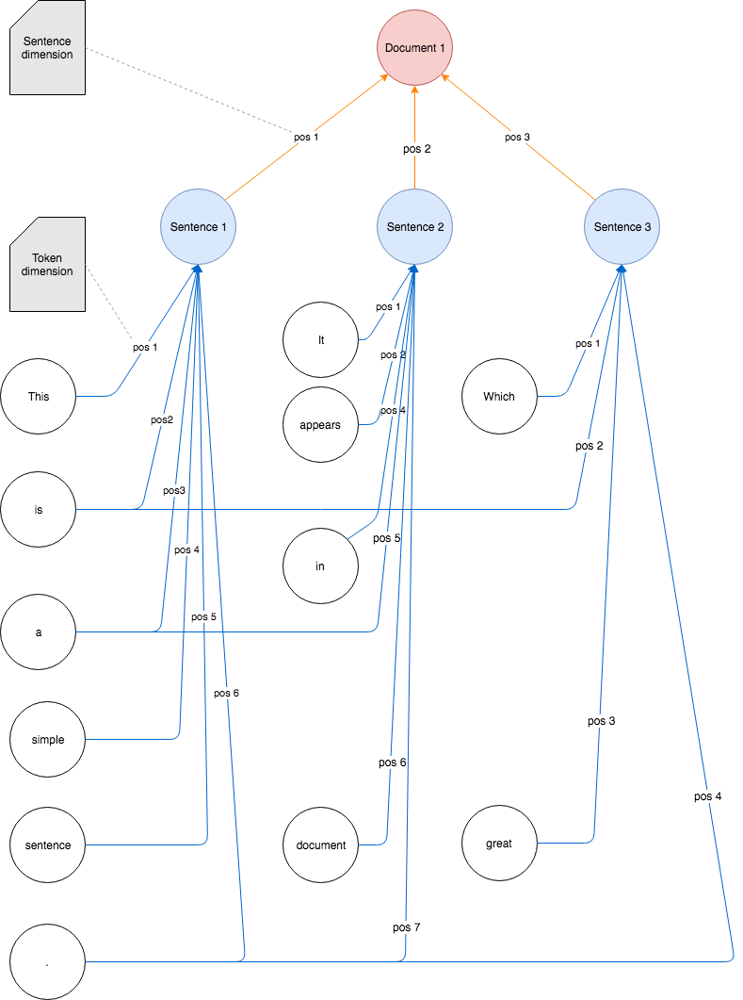

Warm Up!
========

This project is all about modelling and quantifying the relations between words from a [corpus](../common/Glossary.md#corpus) in a [graph](../common/Glossary.md#graph). 

Initial Model
-------------
We start out with a model that includes [tokens](../common/Glossary.md#token), [sentences](../common/Glossary.md#sentence) and a for completeness' sake a [document](../common/Glossary.md#document).

Let's say we have a text that contains three sentences: 

  * *This is a simple sentence.*
  * *It appears in a document.*
  * *Which is great.*
  
We transform these three sentences into a hierarchical graph model:  



The graph model still reveals that the [token](../common/Glossary.md#token) *This* appears once at position 1 in the first sentence, the token *a* appears twice (once at position 3 in the first sentence and once at position 5 in the second sentence) whereas the fullstop terminates all three sentences.
(For the sake of readability we start counting at 1 in this example. This may or may not be perpetuated in subsequent examples or code.)
Hence each [node](../common/Glossary.md#node) in the graph model is an aggregation of all identical surface [occurrences](../common/Glossary.md#occurrence) in the original input sequence.
Each such aggregation is unique within a particular [dimension](../common/Glossary.md#dimension) and we call it a value. 
Note that we haven't aggregated anything else, yet. (No lowercasing, no [lemmatization](../common/Glossary.md#lemmatization), no discarding of punctuation.) We will go for this later.
First, let's find out what we can gain from the raw tokens and the positional information. Say, if the model is useful at all. 

Get Started...
--------------

###In the beginning God created the heaven and the earth...

Let's try this in practice. With a text containing more than three sentences. 
How about the [Bible](#http://bitimage.dyndns.org/german/MartinLuther-1912/Martin_Luther_Uebersetzung_1912.txt)? It's publicly available. It's long. It contains interesting grammar flavors.
In German. It's boring to always look at English.
(The text checked-in with this repo has undergone a bit of data cleaning. In particular the section identifiers heading almost every sentence were removed.) 
 
###Preprocessing

Thanks to [OpenNLP](https://opennlp.apache.org/) sentence detection and tokenization work like a charm. 
The models we are using for these tasks are taken from [Sourceforge](http://opennlp.sourceforge.net/models-1.5/) and are included in this repo only to make the example work out of the box.

###Run

Here's how it's done: 

```
!INCLUDE "../../../java/org/objecttrouve/fourtytwo/graphs/examples/x000/warmup/WarmUpMain.java"
```

Run `org.objecttrouve.fourtytwo.graphs.examples.x000.warmup.WarmUpMain.main`. 
The resulting [Neo4j](../common/Glossary.md#neo4j) database contains the [Bible](#http://bitimage.dyndns.org/german/MartinLuther-1912/Martin_Luther_Uebersetzung_1912.txt) in a graph model as described above. 